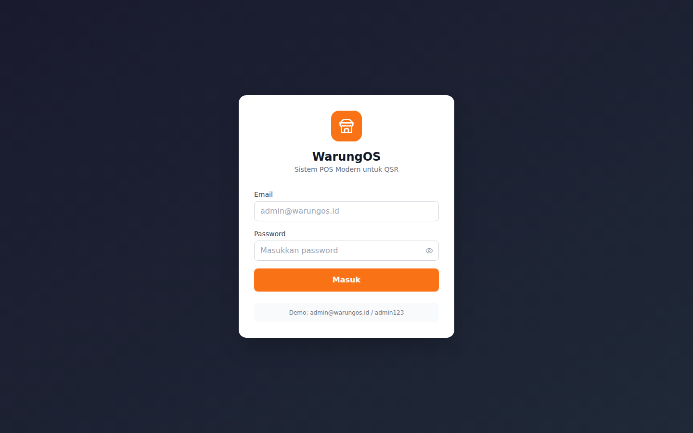
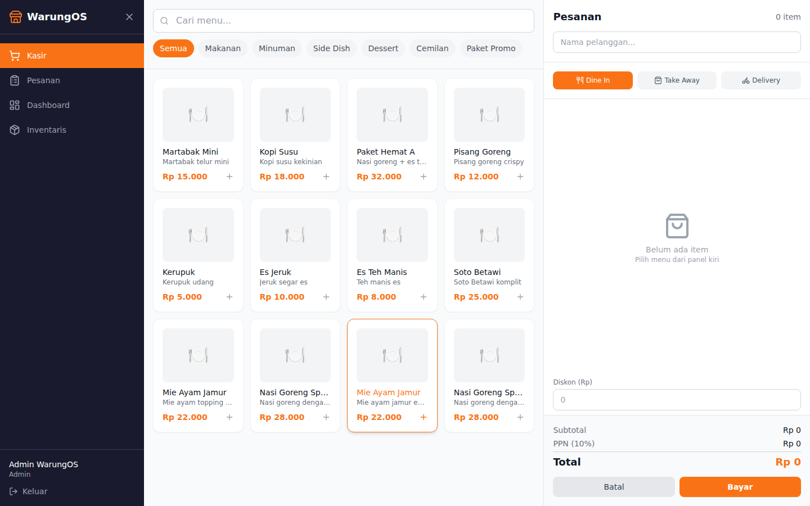
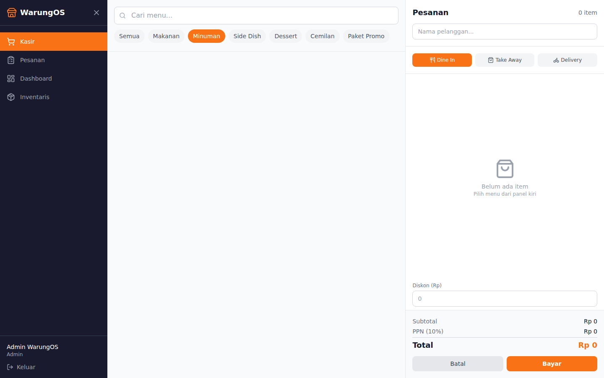
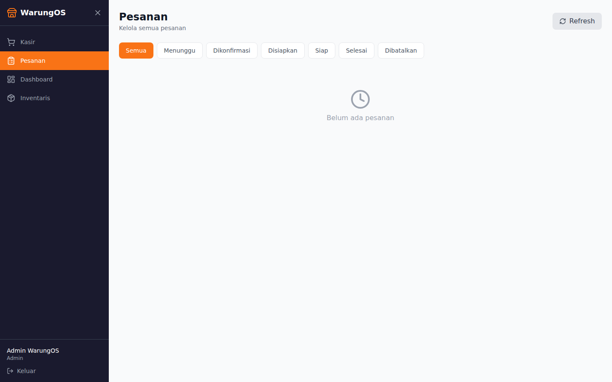
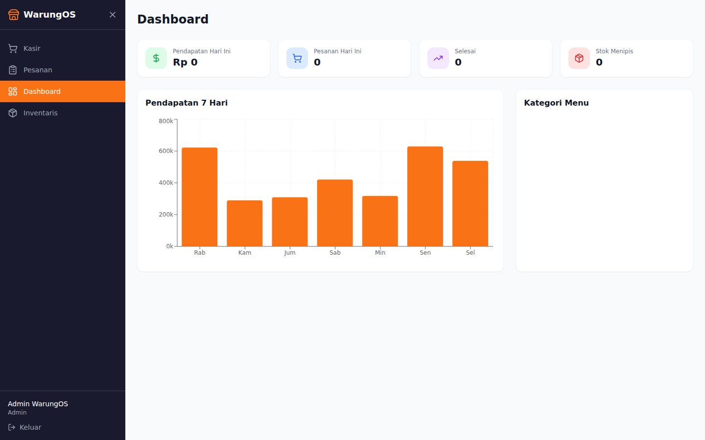
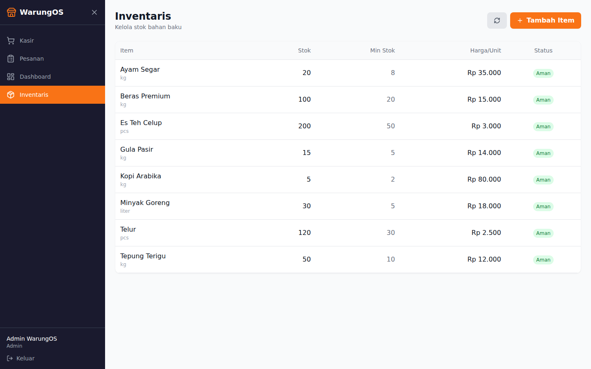

# WarungOS — Modern QSR POS Microservices Platform

> Production-grade Point of Sale system for Quick Service Restaurants (Warung), built with Go microservices, React TypeScript, and multi-database architecture.

## Screenshots

### Login Page


### POS Terminal — Menu Grid


### POS Terminal — Order Cart


### Orders Management


### Dashboard & Analytics


### Inventory Management


## Demo Video

Full transaction walkthrough: Login → POS Terminal → Category Filter → Add Items → Payment (Cash) → Success → Orders → Dashboard → Inventory

▶️ [Watch Demo Video](screenshots/warungos-demo.mp4)

---

## Architecture

```
┌───────────────────────────────────────────────────────────────┐
│                  React TypeScript POS Terminal                │
│          Vite + TailwindCSS + React Query + Recharts          │
└─────────────────────────────┬─────────────────────────────────┘
                              │ HTTP / REST
┌─────────────────────────────▼─────────────────────────────────┐
│                   API Gateway (Go :8080)                       │
│            Chi Router + JWT Auth + Rate Limiter                │
│            Reverse Proxy + CORS + Circuit Breaker              │
└──────┬──────────┬──────────┬──────────┬──────────┬────────────┘
       │          │          │          │          │
┌──────▼───┐┌─────▼────┐┌───▼──────┐┌──▼───────┐┌▼──────────┐
│  Auth    ││  Menu    ││  Order   ││ Payment  ││ Inventory │
│  :9081   ││  :9082   ││  :9083   ││  :9084   ││  :9085    │
│  JWT     ││ MongoDB  ││ PgSQL    ││ PgSQL    ││ PgSQL     │
│  bcrypt  ││ Text     ││ TX ACID  ││ Retry    ││ Atomic    │
│  Redis   ││ Search   ││ PubSub   ││ Idempot  ││ Locking   │
└────┬─────┘└────┬─────┘└────┬─────┘└────┬─────┘└────┬──────┘
     │           │           │           │           │
     ▼           ▼           ▼           ▼           ▼
┌─────────────────────────────────────────────────────────────┐
│        PostgreSQL 16     MongoDB 7        Redis 7           │
│   (users, orders, inv.) (menu catalog) (cache, pubsub)     │
└─────────────────────────────────────────────────────────────┘
                              ▲
                    ┌─────────┴────────┐
                    │   AI Service     │
                    │ Python FastAPI   │
                    │ :8001            │
                    │ Recommendations  │
                    │ Sales Forecast   │
                    │ Smart Reorder    │
                    └──────────────────┘
```

## Tech Stack

| Layer              | Technology                                                |
|--------------------|-----------------------------------------------------------|
| **Backend**        | Go 1.22 (chi router, pgx, go-redis, mongo-driver)        |
| **Frontend**       | React 19 + TypeScript 5 + Vite + TailwindCSS             |
| **Databases**      | PostgreSQL 16 + MongoDB 7 + Redis 7                       |
| **AI**             | Python 3.12 + FastAPI (recommendations, forecasting)     |
| **Infra**          | Docker Compose, multi-stage builds, nginx                 |
| **Payment**        | Midtrans integration (idempotent, retry, webhook)        |

## Quick Start

```bash
# Clone
git clone https://github.com/syawqy/warungos.git
cd warungos

# Start infrastructure
docker compose up -d postgres mongo redis

# Apply migrations
docker exec -i warungos-postgres psql -U warungos -d warungos < migrations/postgres/001_init.up.sql
mongo < migrations/mongo/seed.js

# Build and run
make up

# Access
# POS Terminal:  http://localhost:3000
# API Gateway:   http://localhost:9080
# Health:        http://localhost:9080/health

# Demo login: admin@warungos.id / admin123
```

## Key Features

### POS Terminal (React TypeScript)
- Touch-friendly menu grid with category filters (Makanan, Minuman, Side Dish, Dessert, Cemilan, Paket Promo)
- Real-time cart management with subtotal, PPN (10% VAT), discount calculation
- Order types: Dine In, Take Away, Delivery
- Full Indonesian UI localization

### Dashboard & Analytics
- 7-day revenue bar chart (Recharts)
- Category distribution breakdown
- Today's revenue, orders, completed, low stock summary cards
- Low stock alerts from inventory system

### Go Microservices (5 services)
- **Auth Service** (Go :9081): JWT access + refresh tokens, bcrypt, RBAC (admin/staff/cashier), Redis rate limiting
- **Menu Service** (Go :9082): MongoDB CRUD, text search, aggregation pipeline, Redis cache-aside
- **Order Service** (Go :9083): PostgreSQL ACID transactions, status machine, Redis PubSub for real-time updates
- **Payment Service** (Go :9084): Midtrans integration with retry + exponential backoff, idempotent webhooks
- **Inventory Service** (Go :9085): Atomic stock reservation (optimistic locking), low stock alerts

### AI Features (Python FastAPI)
- **Menu Recommendations**: Time-of-day based suggestions with popularity scoring
- **Sales Forecasting**: Moving average + seasonal adjustment with confidence intervals
- **Smart Reorder**: Consumption rate analysis with reorder suggestions

## Database Design

### PostgreSQL (Transactional)
| Table | Key Columns |
|-------|-------------|
| `users` | id (UUID), email, full_name, password_hash, role, branch_id |
| `branches` | id (UUID), name, address, phone, is_active |
| `orders` | id (UUID), order_number, user_id, branch_id, status, subtotal, tax_amount, total_price |
| `order_items` | id (UUID), order_id (FK CASCADE), menu_item_id, quantity, unit_price, total_price |
| `inventory` | id (UUID), branch_id, item_name, item_code, category, quantity, min_quantity, unit_cost |

### MongoDB (Flexible Catalog)
| Collection | Schema |
|------------|--------|
| `menu_items` | name, category, price, variants[], modifiers[], tags[], branch_ids[] |
| `order_analytics` | Timeseries collection for reporting |
| `ai_insights` | ML model outputs and recommendations |

## Key Patterns Demonstrated

### Redis Patterns
- **Cache-Aside**: Menu items cached with 30min TTL, invalidated on write
- **Deduplication**: Payment webhook idempotency via SetNX
- **Rate Limiting**: Sliding window (100 req/min) using sorted sets
- **Pub/Sub**: Real-time order status updates

### PostgreSQL Optimization
- **Composite Indexes**: `(branch_id, status)` for filtered queries
- **ACID Transactions**: Order creation with atomic stock reservation
- **Optimistic Locking**: `UPDATE ... WHERE quantity >= $1` prevents overselling

### MongoDB Optimization
- **Text Index**: Full-text search on menu name + description
- **Aggregation Pipeline**: Category statistics with $group + $avg

### Async Patterns (Payment)
- **Retry with Exponential Backoff**: 1s -> 2s -> 4s for Midtrans API calls
- **Idempotent Webhooks**: Redis dedup prevents double-processing

## Project Structure

```
warungos/
├── services/
│   ├── api-gateway/        # Reverse proxy + auth + rate limiting
│   ├── auth-service/       # JWT auth + user management
│   ├── menu-service/       # MongoDB menu CRUD + search
│   ├── order-service/      # PostgreSQL order lifecycle
│   ├── payment-service/    # Midtrans integration
│   ├── inventory-service/  # Stock management
│   └── shared/             # Shared Go libraries
│       ├── config/         # Environment config
│       ├── database/       # PostgreSQL + MongoDB clients
│       ├── middleware/      # JWT + CORS middleware
│       ├── model/          # Common types
│       └── redis/          # Cache + PubSub + RateLimit
├── web/                    # React TypeScript POS frontend
│   └── src/
│       ├── api/            # Typed API client (axios)
│       ├── components/     # POS, Layout, Auth components
│       ├── hooks/          # useAuth, useMenu, useOrders
│       ├── pages/          # POS, Orders, Dashboard, Inventory
│       └── types/          # TypeScript interfaces
├── ai-service/             # Python FastAPI AI sidecar
├── migrations/
│   ├── postgres/           # SQL migrations
│   └── mongo/              # MongoDB seed data
├── docker-compose.yml      # Full stack orchestration
├── Makefile                # Build automation
└── screenshots/            # App screenshots
```

## API Endpoints

| Method | Endpoint | Service | Auth |
|--------|----------|---------|------|
| POST | `/api/v1/auth/register` | Auth | No |
| POST | `/api/v1/auth/login` | Auth | No |
| GET | `/api/v1/auth/me` | Auth | Yes |
| GET | `/api/v1/menu` | Menu | Yes |
| POST | `/api/v1/menu` | Menu | Yes |
| GET | `/api/v1/orders` | Order | Yes |
| POST | `/api/v1/orders` | Order | Yes |
| PATCH | `/api/v1/orders/:id/status` | Order | Yes |
| GET | `/api/v1/inventory` | Inventory | Yes |
| POST | `/api/v1/inventory/reserve` | Inventory | Yes |

## License

MIT

---

Built to demonstrate senior-level Go microservices, multi-database architecture, and fullstack TypeScript skills.
